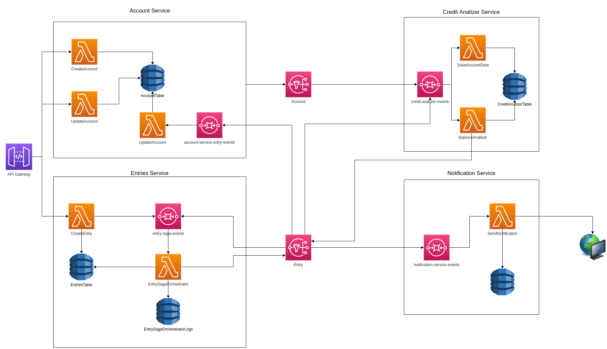

### FBank

O objetivo do projeto é simular um sistema bancário que será composto por quatro microserviços, sendo eles: 

### Account Service

Serviço responsável por gerir os dados de um conta bancária.

### Entry Service

Serviço responsável por gerir os lançamentos realizados (Depósitos, Débitos e Créditos).

### Credit Analizer Service

Serviço responsável por analisar se o cliente tem saldo ou cŕedito suficiente para efetivar um lançamento.

### Notification Service

Serviço responsável por emitir notificações aos clientes do banco.

### Patterns que serão aplicados no projeto

 - Database per service (https://microservices.io/patterns/data/database-per-service.html)
 - Saga (https://microservices.io/patterns/data/saga.html)
 - CQRS (https://microservices.io/patterns/data/cqrs.html)

### Arquitetura Macro



### Instalando dependências

`npm install`

### Rodando o projeto localmente (Docker + Localstack)

1. Inicialize o localstack através do comando: `docker-compose up`
2. Faça o deploy do projeto no localstack através do comando: `sls deploy --stage local`


### APIs

#### Account Service

##### POST /accounts
```json
{
    "customerName": "Felipe",
    "customerWage": 1200,
    "password": "1234"
}
```

##### PUT /accounts/{id}
```json
{
    "customerWage": 600
}
```


